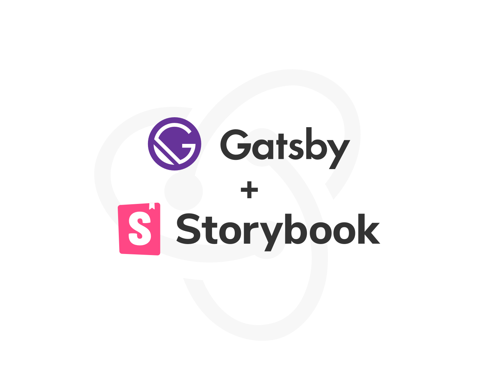

  

 ## GatsbyJS Starter: Redux & Storybook [Demo](https://gatsby-starter-redux-storybook.netlify.com) & 
  
 Gatsby | Storybook | Redux & Redux Persist | Styled Components | Styled Reset Advanced
 
 
                                                                                  
 ## 🚀 Quick start

     gatsby new my-gatsby-site https://github.com/fabianunger/gatsby-starter-redux-storybook
     cd my-gatsby-site
     
  ###  start developing, run
       gatsby develop && yarn storybook
     
###  or you can use a shorter from to run both, the gatsby site and the storybook, with either npm or yarn
       npm run start
       - or -
       yarn start 
 
       
 **Open the source code and start editing!**
 
     Your site is now running at `http://localhost:8000`
     
     The storybook will be running at `http://localhost:9000`
 
     _Note: You'll also see a second link: _`http://localhost:8000/___graphql`_. This is a tool you can use to experiment with querying your data. Learn more about using this tool in the [Gatsby tutorial](https://www.gatsbyjs.org/tutorial/part-five/#introducing-graphiql)._
 
     Open the `my-gatsby-site` directory in your code editor of choice and edit `src/pages/index.js`. Save your changes and the browser will update in real time!
 
 ## 🧐 What's inside?
 
 A quick look at the top-level files and directories you'll see in a Gatsby project.
 
     .
     ├── node_modules
     ├── .storybook
     ├── src
     ├──── __stories__
     ├──── _store
     ├── .gitignore
     ├── .eslintrc.yml
     ├── gatsby-browser.js
     ├── gatsby-config.js
     ├── gatsby-node.js
     ├── gatsby-ssr.js
     ├── LICENSE
     ├── package-lock.json
     ├── package.json
     └── README.md
     
 0.  **`/.storybook`**: This directory holds the storybook configurations, find out more about [storybook](https://storybook.js.org/)
 
 1.  **`/node_modules`**: This directory contains all of the modules of code that your project depends on (npm packages) are automatically installed.
 
 2.  **`/src`**: This directory will contain all of the code related to what you will see on the front-end of your site (what you see in the browser) such as your site header or a page template. `src` is a convention for “source code”.
 
 2.1  **`/src/__stories__`**: This directory will contain all of the stories, find out more about [storybook](https://storybook.js.org/)
 
 2.2  **`/src/_store`**: This directory contains the redux store and configuration, find out more about [redux](https://redux.js.org/introduction/getting-started) and [react-redux](https://react-redux.js.org/introduction/quick-start)
 
 3.  **`.gitignore`**: This file tells git which files it should not track / not maintain a version history for.
 
 4.  **`.eslintrc.yml`**: This is a configuration file containing eslint rules, find out more about how to configure[eslint](https://eslint.org/docs/user-guide/configuring)
 
 5.  **`gatsby-browser.js`**: This file is where Gatsby expects to find any usage of the [Gatsby browser APIs](https://www.gatsbyjs.org/docs/browser-apis/) (if any). These allow customization/extension of default Gatsby settings affecting the browser.
 
 6.  **`gatsby-config.js`**: This is the main configuration file for a Gatsby site. This is where you can specify information about your site (metadata) like the site title and description, which Gatsby plugins you’d like to include, etc. (Check out the [config docs](https://www.gatsbyjs.org/docs/gatsby-config/) for more detail).
 
 7.  **`gatsby-node.js`**: This file is where Gatsby expects to find any usage of the [Gatsby Node APIs](https://www.gatsbyjs.org/docs/node-apis/) (if any). These allow customization/extension of default Gatsby settings affecting pieces of the site build process.
 
 8.  **`gatsby-ssr.js`**: This file is where Gatsby expects to find any usage of the [Gatsby server-side rendering APIs](https://www.gatsbyjs.org/docs/ssr-apis/) (if any). These allow customization of default Gatsby settings affecting server-side rendering.
 
 9.  **`LICENSE`**: Gatsby is licensed under the MIT license.
 
 10. **`package-lock.json`** (See `package.json` below, first). This is an automatically generated file based on the exact versions of your npm dependencies that were installed for your project. **(You won’t change this file directly).**
 
 11. **`package.json`**: A manifest file for Node.js projects, which includes things like metadata (the project’s name, author, etc). This manifest is how npm knows which packages to install for your project.
 
 12. **`README.md`**: A text file containing useful reference information about your project.
 
 ## 🎓 Learning Gatsby
 
 Looking for more guidance? Full documentation for Gatsby lives [on the website](https://www.gatsbyjs.org/). Here are some places to start:
 
 - **For most developers, we recommend starting with our [in-depth tutorial for creating a site with Gatsby](https://www.gatsbyjs.org/tutorial/).** It starts with zero assumptions about your level of ability and walks through every step of the process.
 
 - **To dive straight into code samples, head [to our documentation](https://www.gatsbyjs.org/docs/).** In particular, check out the _Guides_, _API Reference_, and _Advanced Tutorials_ sections in the sidebar.

## 💫 Deploy

To deploy the site on netlify enter the following under the **`Build settings`**  of the project:

### Gatsby Site

**`Build command`**: yarn build

**`Publish directory`**: public

### Storybook

**`Build command:`**    yarn build:storybook

**`Publish directory:`**    storybook

